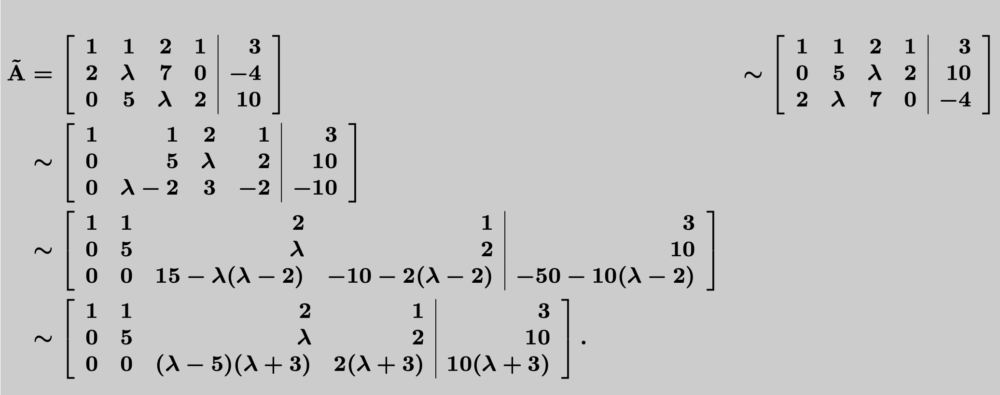
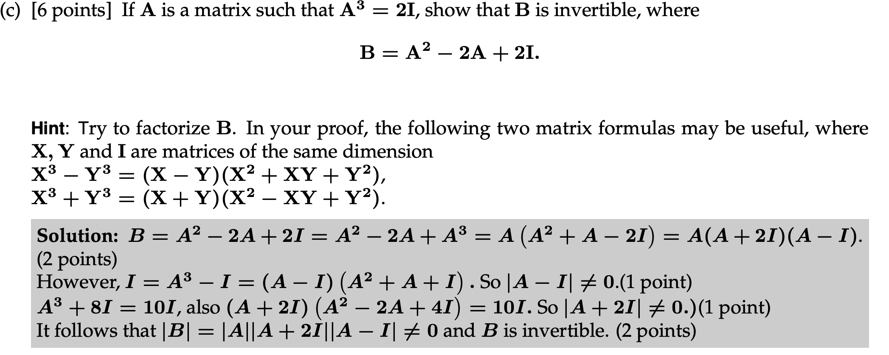

avoid fraction in row operation.

the steps of row operation need to be stated only in row operation in matrix ( 
find the rank), simplify the augmented matrix doesn't require statement of steps 
of row operations.
if the matrix in guass method has denominator may equal to zero, the solution
should expressed in two case:
$\frac{1}{x-5}$, two cases: $x = 5, x\neq 5$
# Use fratorization to prove $det \neq 0$
    

