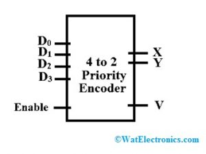
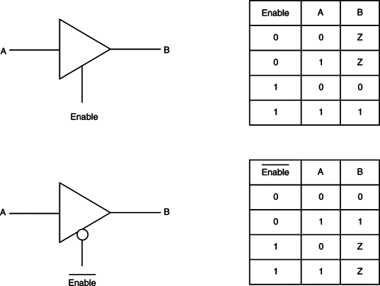

# Procedure to find any wanted logic operation
1. declarated clear statement
2. plot ture table
3. use map to optimize the mit-terms

# Standard commbination cirucuit
## Adder
*half adder**
two digit addition

**full adder**
three digit addition
use for any bit addition by adding each	order of significant bit and input carry 
bit
two bit input and two bit output

## half adder
two bit input and two bit output
input: x, y
output: c(carry bit), s(sum)
$$ s = x\oplus y $$
$$c = xy$$ 

## full adder
three bit input and two bit output
input: x, y, z
output: c(carry bit), s(sum)
$$ s = x\oplus y \oplus z $$
$$c = (x\oplus y) z$$
three is enough to calculate any number of bit adders
initial carry bit set to 0

## Adder-Sbutracter
capable to perform adding and subtracting by having different mode input
similiar to adder, even can act as adder, if mode $M$ = 0
one's complement equal to take inventor to the input
the initial carry bit set to 1, which is done by the mode $M$ and xor gates.

## Subtractor
perform for subtraction
for half subtractor, the output are: 1. difference 2. carry borrow
## Multiplier multiply each bit accordingly, can use and gates to indicate the 
    result of a pair of single bit multiplcation.

## Mmangitude comparer
compare each bit t observe wether they are the same, the first have a unequal most significant bit is the larger one.

## decoder
give n logic input, output maiximum $2^n$ min terms.
decoder convert n input to m output, where m smaller or equal to maximum.
Enable input is the control unit that choose decoder or not.
The enable input can be activiated by either 0 or 1 signal.

## demultiplexer
decoder + multiplexer in the smae time, choose result from decoder
one input and $n$ control input, it support maximun up to $2^n$ output.
the concrpt of selection is like encoder, use arrange minterms in order to 
select the correct output.

## Encoder
reverse of the decoder, add enable input( swtich), it can be active or inactive 
by choosing the sign of tthe enable input
## priority Encoder
defined the truth table is in the desired form which is in stairway, and the output is in the order of defined way.
Use don't care condition to implemenet priority check and obtain the boolean 
expression.

V is valid

## mutliplexer/data selector
also call as data selector, by using enable input and selector input, can 
select one set of data to pass through. 

# Boolean function implementation
find the value of function of $F$ for knowns minterms.

## threee states gates
work like circuit, when the control input is zero, no matter the input is, the output is always zero.
buffer, which proporate the original value of input to output.

there are tri-state buffer and tri-state invertor.
the control unit determine how the tri-state buffer work, some it work in 
active-high or active-low, depends on the design of the logic input of control 
unit.
