# The basics of Sequential logic 
circuit integrate combinational logic and memory, has time state input and time state 
output.
**clk**:
usally clocked circuit or simply a periodic input signal.
**flip flops**:
one bit storages, it is edge-triggered, the state changed only during the time that the 
state(usually CLK) changed.
**latch**:
one bit storages, it is level-triggered, the state of latch always update to the state of 
input(usually CLKL) $$Q(t+1) = f\big(Q(t)\big)$$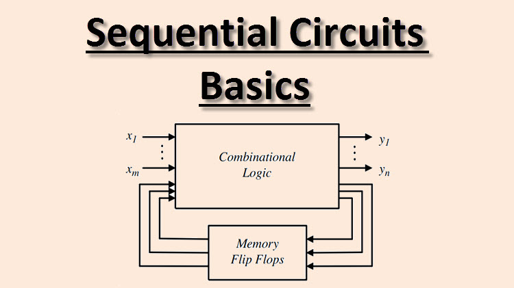

Initialization will be taken in other place don't worry this.
[Initialization](./sequential_logic# Positive-edge-triggered-flip-flop)

**Flip-flop**
is a binary storage that store one-bit information, like the black-white flag in three 
body.

## basic Latched
**SR-Latches**
Will not change the state if input doesn't change. It is implmeneted by NOR gates.  The state follow the state of R(reset) and S(set).
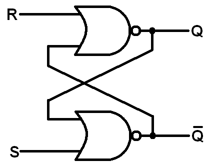

**S'R'-lateches/RS-latches**
Implemented by NAND gates. The state follow the complement of the R(reset) and S(set).
 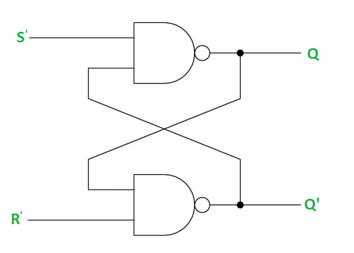

$S'R'$ or $RS$ latch differ from $SR$ latch that the input is in complement
form.

**SR-latches with contol input**
implement by two level NAND gates.
Q stand for set states, Q' stand for reset states.

# Flip-flops

## Usage of flip flops
flips-flops is use to store the input, a D-type flip flops will store the input
of D, Q will always equal to D and its complement is store in Q'.  Store as the
next state. Flip flop will not change the state if the input R and S back to
the base state, example, in active high, RS=01, back to RS=00 will not change
the state of Q(t).

## Types_of_flip_flops
**SR flip flops**
Clocked version of SR latch. Use AND gates for CLK.
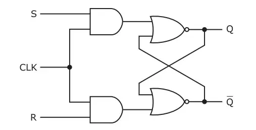
**RS flip flop**
Clocked version of RS latch. Use NAND gates for CLK.
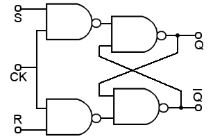
**D flip flop**
Storage the input into Q and its complement to Q'. Next state equal to present states.
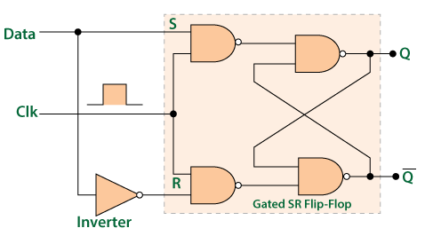
or in this simplify form:
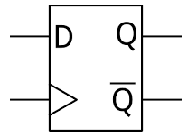
**jk flip flops**
Change the state of the input of J and K to change the value store in flip flops.
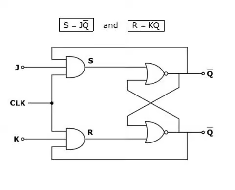
or in this simplify form:
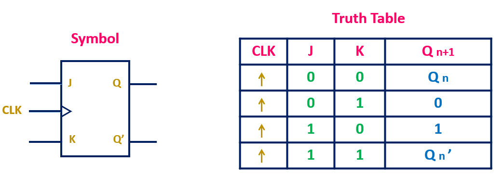
**t flip flops**
Complement the information storing inside the flip flops.
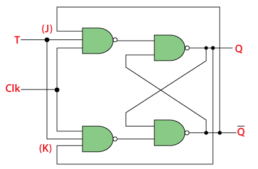
or in this simplify form:

### Conservation between flip flops
**JK -> T**
When J and K connect to the same input, it become T flip flops.

## boolean algebra of jk flip flop and T flip flop
$$D: Q(t+1) = D$$
$$jk:Q(t+1) = JQ' + K'Q$$
$$T: Q(t+1) = TQ' + T'Q$$
D is the input in D flip flops.

# Avoid the change of output when the clock is active state.
**Master-slave D flip-flops**
change the out put whenever the pulse change.
**D type positive/negative edge-triggered flip flops**
change merely when the poitive/negative transition occur.

## Flip flops triggeration
1. Level triggerred
2. edge triggerered(PETFF)
3. Master slave triggered(MSFF)

### Level triggered
Latch with CLK is a level triggered flip flop(or simply Flip flop).
**level triggered:**
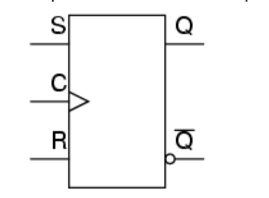

### Positive-edge-triggered-flip-flops
Use three active high NAND latch to implement the positive edge triggered flip 
flops. Key idea is lock the input of R and S. Use $Reset$ to initialize the 
state of the flip flops. $Reset$ should be independent of the clock pulse $CLK$ 
and the input $D$.
**Positive edge triggerered:**

### Master slave Flip flops
Use two layer of level triggered flip flops to perform a edge triggered flip 
flop, negative or positive edge triggered can be changed by complement the 
CLK.
**Master slave triggered:**

### Why PETFF is needed when we can use MSFF
Because the PETFF use the least gates.

# Analysis of clocked sequential ciruits
## Procedure of Analysis
1. Find the state equation
2. Derive the state table
3. drwa the state diagram
4. derive the purpose of the ciruit.
## State table
1. present state
2. input(if have)
3. next state
4. output(if have)

## State diagram insert a picture here.

## Characteristic equation
The equation describe how the flip flop works.
$$Q(t+1) = F\big(Q(t)\big)$$
The input in sequential circuit $Q$ is the current state, the output and then direct to 
the flip fop again is the next state $Q(t+1)$, 

## Flip flops input equation
For convenience, the input equation variables is defines in form of $$D_A=x+y$$ where 
$D$ is the input D of the flip flop
and $A$ is the output of the flip flops with respect to the input D( indicate that A is 
related to D ), $x$ and $y$ are the input that connect to the input of the flip 
flop.
$D_A$ mean the output $A$ from the input of $D$ flip-flop.

## Different types of equations
**characteristic equation:**
descirbe how the flips flops works.
**input equation:**
describe the relationshiop between external inputs and the flip flop inputs.
**State equation:**
the expression of $Q(t+1) = F\big(Q(t)\big)$ in terms of external inputs and the present state.

# Finite State Machine(FSM)
## Merely and Moore machine
**Mearly:**
The outpute depends by the present state and the present input.
**Moore:**
The outputs depend by the present state only, so moore machine is synchronized with the 
clock.

## State reduction
Remove the equivalent one that is with the same inputgive the same output and 
the same state.

## Assignment Assign a binary number to the states.

## Excitation table
The table present the transition from $Q(t)$ to $Q(t+1)$

## Sythesis
Sythesis means the procedure to desgin logic circuit from descrition words to circuit 
implementation.
The standard process:
1. interruption
2. state diagram -> state reduction
3. minimialization

# Propagation Delay
Real world circuit will perform in unpredictable behaviour when propagation delay 
exist.

<!-- asdfasdf

asfdasdfsaf-->
