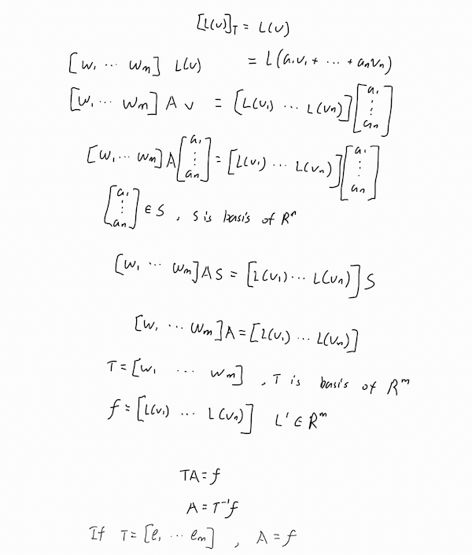

Linear transformation $L: V\rightarrow \space W$ defined by $L(v)=w$ for $v$ in 
$V$ and $w$ in $W$ 

Ker and Range is vector space
**ker**
$ker\space L$ is the subset of V that $L(v) = 0_W$
**range**
$range\space L$ is the set that the linear transformation obtain, if this set 
span the vector sapce W, then L is onto W, same as the image of V under L is 
whole cover on W.

$$dim\space range\space L + dim\space ker\space L = dim\space V$$
Centain number of basis of V can be transform to vector in W while the remaing 
basis doesn't matter to W, since they cannot transform to any vector in W, so 
they are containing in the null set of W, which is $0_W$ 

The basis of range L and ker L is linearly independent, since they come from the 
same basis of $V$. (see the proof) 

**Onto, one-to-one and invertible**
$L$ is onto if range $L$ is $L(V)=W$, the linear transformation give the whole 
vector space of $W$ .
if dim $V$ = dim $W$, then $L$ is **onto** and **one-to-one**, hence $L$ is 
invertible.

Linearly independcy is not perserved to keep after linear transformation.  
consider linear transformation $L(V)=0$

$L^-1$ exist only if the two vector space is onto and one to one, and their 
dimension must be the same.

**Processing to find Matrix A for Linear transformation $L$**
$$L : V \rightarrow W $$
where,
$$L:R^n \rightarrow R^n$$

set $S = {v_1, v_2 , ... , v_n}$
set $T = {w_1, w_2 , ... , w_m}$
S and T is the oreder basis of vector space V and W respectively.
1. find the $L(v_j)$ for every basis in set S.
2. solve $[L(v_j)]_T$
tips: use partial matrix to solve the multi linear system $$[w_1 \space w_2 
\space \cdots w_m \space \space|\space\space L(v_1)\space|\space L(v_2) |\space 
\cdots |\space L(v_n)] $$
3. the solution is give Matrix A if not specified, choose the natural basis as  
$S$ and $T$. 

final result we find is  $[L(x)]_T = A[x]_S$
The matrix $A$ differ when the ordered basis of $S$ and $T$ are different.  
Prerequires: we need to know how linear transformation $L$ is.

# Why the coordinate matrix is the matrix representation.

$A$ is the matrix associate to linear transformation $L$ with respect to bases 
$S$ and $T$.

## Isomophism and linear transformation
Linear transformation is ismophetic to matrix space.
To prove a linear transformation is linear independent,
we solve for $a_1, a_2, \cdots a_n$:
$$a_1L_1 + a_2L_2 + \cdots a_nL_n=0 $$

## The requirement to be linear transformation
To prove it is linear combination of something is sufficient, that is it need to 
satisfy addition and multiplication properies

# Similarity
dimension should be the same, square matrix

